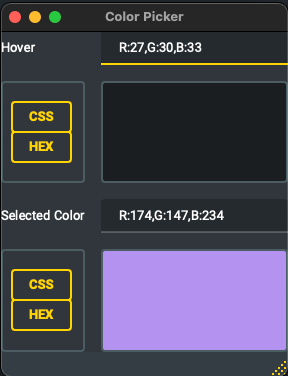

# Color Picker

Simple pyqt6 app that works as color picker

## Goal

- Create a app window with 2 fields
  - Field 1: Color of pixel where cursor is located (ignore pixel inside app window)
    - Pool color of pixel with signal
  - Field 2: Color of pixel where last click event happen
- App should be always on top
- Build app for multiple platforms
  - Add assets for customized build(icon)
- Add buttons to copy color to clipboard as CSS color property and HEX value of color

## Ui example



## Packaging

For creation of executable file we will use pyintaller. It allows to build executable app for multiple platforms.
Still platform have some specific parameters:

- Add data path different on unix/windows
- Supported icon image extension different for unix/windows
  For build on local machine you will need some changes:
- Use pyenv for python version handling, and it require some extra argument when installing
  - ```bash
        PYTHON_CONFIGURE_OPTS="--enable-framework" pyenv install 3.11.0
    ```

Build process is present in GA workflow `build.yml`
it build executable for linux,mac,windows on each tag that match pattern "v\*"

## Summary and comparison with electron

Pros and cons when creating apps with pyqt6

Pros:

- Allow you to quickly create app using python
- Full QT syntax
- Easy way to build general multi platform apps
- Low memory usage

Cons:

- In terms of program speed, Javascript under Electron is going to be faster than Python with Qt. Python has no JIT and it's often orders of magnitude slower than JS's V8 interpreter.
- Qt quite hard to adopt
- Need to use qt-designer for creation .ui file even for small apps
- Don't have allot of plugins
- Creating interfaces is slow, even with qt-designer
